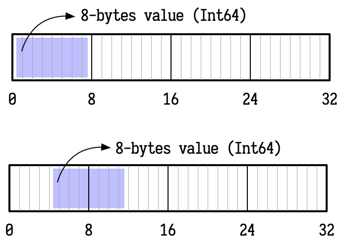

## Unsafe Pointer

Swift 中有一系列指针类型, 简单地指向一块内存地址, 允许通过地址直接访问该块内存中的数据 (使用 `pointee` 属性或下标 `[0]`). 和 C 语言类似, Swift 此时也不会保证内存安全性, 一个指针类型可能会变成悬垂的, 且访问悬垂指针不会产生错误提示 (仅仅会读到无意义的数据).

```swift
let array = [1, 2, 3, 4, 5]
let pointer = UnsafePointer<Int>(array)

for i in 0..<5 {
    print((pointer + i).pointee)
    // Print: 1 2 3 4 5
}
```

> **Note**
>
> Swift 的内存模型并不像 C 或 C++ 那样, 保证对象一直保存到作用域的结尾, 只要对象不会再被使用, 就可能会被释放, 因此上述代码可能无法正确的打印出 1 ~ 5. 后文有类似的情景, 不再赘述.

Swift 共提供了 9 个指针类型, 除了专门用于和 Objective-C 交互的 `AutoreleasingUnsafeMutablePointer<T>` 类型外, 还有:

| Immutable                      | Mutable                               |
| :----------------------------- | :------------------------------------ |
| `UnsafePointer<Pointee>`       | `UnsafeMutablePointer<Pointee>`       |
| `UnsafeBufferPointer<Pointee>` | `UnsafeMutableBufferPointer<Pointee>` |
| `UnsafeRawPointer`             | `UnsafeMutableRawBufferPointer`       |
| `UnsafeRawBufferPointer`       | `UnsafeRawBufferPointer`              |

其中, 类型指针 (typed pointer) 拥有一个关联类型 (associated type) `Pointee`, 表示它指向的类型, 而原生指针 (raw pointer) 则相当于是非原生指针对 `UInt8` 类型的特化, 总是指向内存中一个字节 (byte) 的内容.

操作这些指针最简单 (且安全) 的方式就是使用一系列名为 `withXxxxxPointer` 的函数:

```swift
var π = 3.14159
withUnsafePointer(to: &π) { pointer in
    print("\(pointer): \(pointer.pointee)")
    // Print "0x000000010d870060: 3.14159"
}
```

## 调用以指针为参数的函数

手动操作内存的第一步就是调用那些以指针为参数的函数, 而参数传递时, 一些类型能够隐式地转换 (implicit cast) 为指针类型, 这些特殊的转换规则比较繁杂.

### 1. 调用以 `UnsafePointer` 为参数的函数

`UnsafePointer<Type>` 是常 (constant) 指针, 可由如下类型隐式转换得到:

- 如果有必要, `UnsafePointer<Type>`, `UnsafeMutablePointer<Type>`, 或 `AutoreleasingUnsafeMutablePointer<Type>` 可以隐式转换为 `UnsafePointer<Type>`;
- 对于一个 `String` 类型的值, 如果 `Type` 是 `Int8` 或 `UInt8`, 字符串会自动转化为一个以 `0` 终结的缓冲区, 并将缓冲区的首地址传入;
- 对于一个可变变量的 in-out 表达式, 将该变量的地址传入;
- 对于一个 `[Type]` 类型, 将数组首元素的地址传入;

```swift
func print<Type>(unsafePointer pointer: UnsafePointer<Type>) {
    print("\(pointer): \(pointer.pointee)")
}

var π = 3.14159
print(unsafePointer: &π)
// Print "0x0000000100003110: 3.14159"

var array = [10, 20, 30]
print(unsafePointer: array)
// Print: "0x000000010407ca50: 10"
```

对于 `[Type]` 转换而成的指针, Swift 支持和 C 语言类似的指针运算 (并且不会进行越界检查):

```swift
var array = [10, 20, 30]

let pointer = UnsafePointer<Int>(array)

print(pointer.pointee)       // Print "10"
print((pointer + 1).pointee) // Print "20"
print((pointer + 2).pointee) // Print "30"
```

顺便一提, `print(unsafePointer: array)` 和 `print(unsafePointer: &array[0])` 得到的地址是不同的, Swift 的 in-out 参数的求值策略 (evaluation strategy) 并非是传引用调用 (call by reference), 而是按传递复件-恢复调用 (call by copy-restore) 的, 也就是说, 带 in-out 参数的函数在被调用时总是先产生参数的一个临时副本, 对副本进行修改, 函数结束后再将副本复制回原处, 覆盖原来的值, 显然, in-out 表达式 `&array[0]` 传递时 `print(unsafePointer:)` 函数为它创造了一个临时的副本, 因此得到的地址并不是指向 `array` 首部的真实地址, 此时对其进行指针运算 (如指针加法 `+` 和指针减法 `-`) 也是完全无意义的行为.

调用以 `UnsafeRawPointer` 为参数的函数时, 可传入的参数类型和 `UnsafePointer` 类似.

```swift
func print<T>(unsafeRawPointer pointer: UnsafeRawPointer, as type: T.Type) {
    print("\(pointer): \(pointer.load(as: type))")
}

var π = 3.14159
print(unsafeRawPointer: &π, as: Double.self)
// Print "0x0000000100003118: 3.14159"

var array = [10, 20, 30]
print(unsafeRawPointer: array, as: Int.self)
// Print "0x00000001005be080: 10"
```

`UnsafeRawPointer` 能提供的约束更少, 当读取数据时, 必须使用 `load(as:)` 方法指定类型, 同时必须保证数据格式无误.

```swift
var array = [10, 20, 30]

let pointer = UnsafeRawPointer(array)

print(pointer.load(as: Int.self))        // Print "10"
print((pointer + 8).load(as: Int.self))  // Print "20"
print((pointer + 16).load(as: Int.self)) // Print "30"
```

### 2. 调用以 `UnsafeMutablePointer` 为参数的函数

`UnsafeMutablePointer<Type>` 是可变 (mutable) 指针, 可由如下类型隐式转换得到:

- 对于一个可变变量的 in-out 表达式, 将该变量的地址传入;
- 对于一个 `[Type]` 类型的 in-out 表达式, 将数组首元素的地址传入, 并延长其生命周期至函数调用结束;

```swift
func print<Type>(unsafeMutablePointer pointer: UnsafeMutablePointer<Type>) {
    print("\(pointer): \(pointer.pointee)")
}

var array = [10, 20, 30]
print(unsafeMutablePointer: &array) // Print "0x00007fd6ade23610: 10"

func suc(_ n: UnsafeMutablePointer<Int>) {
    var result = n.pointee + 1
    n.assign(from: &result, count: 1)
}

var integer = 42
suc(&integer)
print(integer) // Print "43"
```

### 3. 其他

Swift 的指针还有很多上文中未提到的用法, 主要和 C FFI 和 Objective-C FFI 相关, 这里不再详细叙述.

## 内存布局

Swift 提供了内存布局 (memory layout) 的辅助工具 `MemoryLayout<T>`, 它有三个的属性 (以及三个对应的静态方法):

- `MemoryLayout<T>.size` 或 `MemoryLayout.size(ofValue:)`: 返回类型 `T` 的连续内存占用量;
- `MemoryLayout<T>.stride` 或 `MemoryLayout.stride(ofValue:)`: 在数组 `[T]` 中为 `T` 类型分配空间时, 两个元素起始地址之间的距离.
- `MemoryLayout<T>.alignment` 或 `MemoryLayout.alignment(ofValue:)`: 类型 `T` 的默认对齐;

内存布局中最重要概念就是**对齐** (alignment). 许多计算机系统对原始数据类型允许出现的地址进行了限制, 要求某种类型的地址必须是某个值 k 的倍数 (通常是 2, 4 或 8), 这个 k 就被称为该类型的对齐 (alignment). 这种对齐限制简化了处理器和存储系统间硬件接口的设计. 假设处理器每次从内存中读取 8 字节, 且地址必须为 8 的倍数, 如果能够保证任何 `Int64` 的地址为 8 的倍数, 那读取该值时就只需要一次内存操作, 否则可以需要两次内存访问, 部分指令集根本就不允许后者.



一般来说, 基础类型的对齐 (alignment) 就是他的尺寸 (size).

```swift
MemoryLayout<UInt8>.alignment  == MemoryLayout<UInt8>.size
MemoryLayout<Int>.alignment    == MemoryLayout<Int>.size
MemoryLayout<Int32>.alignment  == MemoryLayout<Int32>.size
MemoryLayout<Double>.alignment == MemoryLayout<Double>.size
MemoryLayout<Bool>.alignment   == MemoryLayout<Bool>.size
```

### 1. 结构体类型的布局

对于结构体来说, 情况就要更加复杂一些. 结构体的对齐是指各成员变量存放的起始地址相对于结构的起始地址的偏移量必须为该变量的类型所占用的字节数的倍数, 各成员变量在存放的时候根据在结构中出现的顺序依次申请空间, 同时按照上面的对齐方式调整位置, 空缺的字节自动填充 (padding). 同时为了确保结构的大小为结构的字节边界数 (即该结构中占用最大的空间的类型的字节数) 的倍数, 在为最后一个成员变量申请空间后, 还会根据需要自动填充空缺的字节.

简而言之, 结构体的对齐遵循如下三条规则:

1. 结构体变量的起始地址应该能够被其最宽的成员大小整除;
2. 结构体每个成员相对于起始地址的偏移能够被其自身大小整除, 如果不能则在前一个成员后面补充字节;
3. 结构体总体大小能够被最宽的成员的大小整除, 如不能则在后面补充字节;

```swift
struct A {
    let a: Int8
    let b: Int16
    let c: Int64
    let d: Int8
}

MemoryLayout<A>.size      // 17
MemoryLayout<A>.stride    // 24
MemoryLayout<A>.alignment // 8
```

对结构体 `A` 运用如上的三条规则, 可求得:

- `alignment` 和最大的成员 `Int64` 保持一致, 为 8;
- `size` 是填充字节后的连续内存占用量, 为 17;
- `stride` 必须能被其最宽的成员大小整除, 为 24;


> **Note**
>
> 在 Swift 中, 使用 `UnsafePointer<T>` 为 `T` 分配空间时, 应使用 `stride` 而不是 `size`.

### 2. 枚举类型的布局

除了结构体 (structure) 类型之外, Swift 中还有类 (class) 类型和枚举 (enumeration) 类型两种复合类型. 其中类类型是引用类型 (即地址), 在栈上的尺寸与对齐和 `Int` 类型完全相同, 不必详细展开, 但枚举类型则是值类型, 而且拥有比较复杂的布局规则.

Swift 中的枚举类型是和类型 (sum type), 也被称为标签联合类型 (tagged union), 顾名思义, 其布局规则类似于 C 语言的联合 (union) 类型, 但额外需要一块空间来存储类型标签, 以确保类型安全.

> **Note**
>
> 在 C 语言中, 联合 (union) 类型可能存储任何一个成员变量
>
> ```c
> union U {
>      int32_t integer;
>      double real;
> };
> ```
>
> 以如上代码为例, `union U` 类型的值要么是 `int32_t` 类型的 `integer`, 要么是 `double` 类型的 `real`, 因此该类型的大小只要取 `sizeof(int32_t)` 和 `sizeof(double)` 中最大的即可, 显然 `sizeof(union U) == 8`.
>
> 不过, 联合类型有一个明显的缺点, 就是它不会进行类型检查, 即使存的是 `double` 类型, 取 `int32_t` 类型也不会报告任何错误, 字节序列会直接按 `int32_t` 类型的编码解释, 这后来甚至成为了 C 语言中一种惯用的强制类型转换手段. 这在追求类型安全的语言中是不可忍受的行为.
>
> 其中一个解决方案就是为 `union U` 搭配一个枚举类型 `enum E`, 记录 `union U` 中存放变量的类型, 并在运行时进行判断:
>
> ```c
> enum E {
>     Integer,
>     Real
> };
> 
> enum E e = Real;
> union U u; u.real = 3.14;
> switch (e) {
>     case Integer:
>         printf("%d", u.integer);
>         break;
>     case Real:
>         printf("%lf", u.real);
>         break;
> }
> ```
>
> 这样就有了一个简易的标签联合类型 (tagged union type), 其中 `enum E` 是标签, 而 `union U` 是联合体.

以如下的枚举类型 `E` 为例:

```swift
enum E {
    case a
    case b(Int8)
    case c(Double)
}

MemoryLayout<E>.size      // 9
MemoryLayout<E>.stride    // 8
MemoryLayout<E>.alignment // 16
```

其中, 尺寸最大的枚举项为 `Double` 类型, 因此联合体部分占 8 字节, 加上额外的占 1 个字节的标签, 可求出 `size` 为 9.


> **递归定义的枚举类型**
>
> 这样的枚举类型存在一个巨大的缺陷, 就是它不允许递归的定义类型, 以如下的函数式链表为例:
>
> ```swift
> enum List<Element> {
>     case null
>     case cons(Element, List<Element>)
> }
> ```
>
> 类型的大小必须是编译期已知的, 但计算时却出现了问题. 以 `List<Int>` 为例, `cons` 构造器构造的值包含一个 1 字节的标签, 一个 8 字节的 `Int` 值, 还有一个未知数量字节的 `List<Int>`. 问题就出在这, 计算 `List<Int>` 的过程陷入了无尽的递归.

### 3. 间接枚举类型的布局

Swift 拥有另外一种枚举类型, 即间接 (indirect) 枚举, 它的枚举情况全部变为了引用, 因此间接枚举类型的尺寸总是和 `Int` (地址) 保持一致.

```swift
indirect enum List<Element> {
    case null
    case cons(Element, List<Element>)
}

MemoryLayout<List<Int>>.size      // 8
MemoryLayout<List<Int>>.stride    // 8
MemoryLayout<List<Int>>.alignment // 8
```

这样的枚举类型主要有两个作用:

- 它拥有编译期已知的尺寸, 因此能够递归的定义;
- 它不需要给尺寸较小的枚举情况填充无用字节, 可以有效地避免空间浪费;

(完)