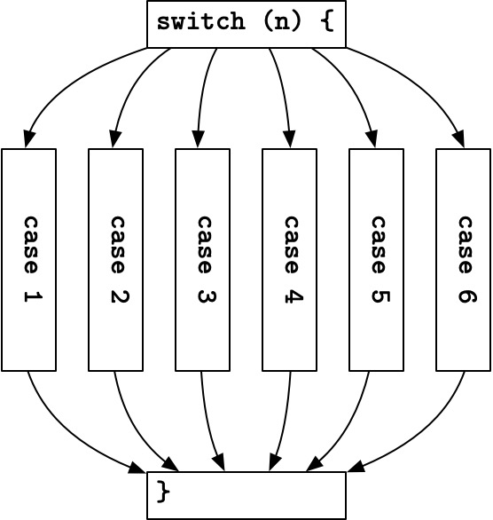
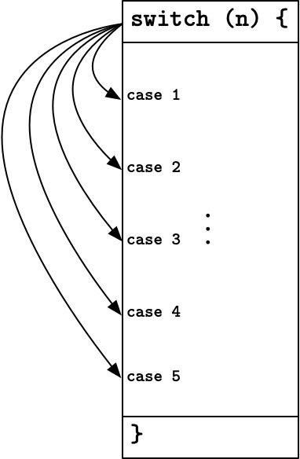

# `switch` 和 `break` 的故事

写在前边: 本文中的 `switch` 特指 C 中的 `swicth` 语句, 而诸如 Swift 等语言中的 `switch` 语句, 本质上是模式匹配 (pattern matching), 和本文无关喵.

## 跳转表

我一直都非常喜欢 C 的 `switch` 语句, 因为它既有高级语言的外表, 又不失汇编的神韵.

有些人在刚开始学编程的时候会把 `switch` 语句理解成 `if-else` 语句的语法糖, 这是个典型的谬误, 正确的理解应该是将它看作一段带 `case` 标签 (label) 的代码.

达夫设备 (Duff's device) 就是将这种机制运用到极致的一个例子:

    switch (count % 8) {
    case 0:    do { *to = *from++;
    case 7:         *to = *from++;
    case 6:         *to = *from++;
    case 5:         *to = *from++;
    case 4:         *to = *from++;
    case 3:         *to = *from++;
    case 2:         *to = *from++;
    case 1:         *to = *from++;
               } while(--n > 0);
    }

编译器会为它生成一个数组, 你可以通过索引以 $O(1)$ 的复杂度获得要调转到的 PC 地址.

    .LS:    @ jump table
            .word   .L0+1
            .word   .L7+1
            .word   .L6+1
            .word   .L5+1
            .word   .L4+1
            .word   .L3+1
            .word   .L2+1
            .word   .L1+1
    .LN:
            nop
    .L0:
            mov     r3, r4
            adds    r4, r3, #2
            ldrsh   r3, [r3]
            strh    r3, [r5]
    .L7:
            mov     r3, r4
            adds    r4, r3, #2
            ldrsh   r3, [r3]
            strh    r3, [r5]
    .L6:
            mov     r3, r4
            adds    r4, r3, #2
            ldrsh   r3, [r3]
            strh    r3, [r5]
    .L5:
            mov     r3, r4
            adds    r4, r3, #2
            ldrsh   r3, [r3]
            strh    r3, [r5]
    .L4:
            mov     r3, r4
            adds    r4, r3, #2
            ldrsh   r3, [r3]
            strh    r3, [r5]
    .L3:
            mov     r3, r4
            adds    r4, r3, #2
            ldrsh   r3, [r3]
            strh    r3, [r5]
    .L2:
            mov     r3, r4
            adds    r4, r3, #2
            ldrsh   r3, [r3]
            strh    r3, [r5]
    .L1:
            mov     r3, r4
            adds    r4, r3, #2
            ldrsh   r3, [r3]
            strh    r3, [r5]
            subs    r6, r6, #1
            cmp     r6, #0
            bgt     .L13

这就是跳转表 (jump table) 啦.

有没有发现它很像我们所熟悉的表驱动法 (table-driven method)?

    let week = ["mo", "tu", "we", "th", "fr", "sa", "su"]
    let today = week[n]
    print(today)

它们的本质其实是一样的, 只不过前者驱动的是 PC, 后者驱动的是数据 (当然所谓的 “数据”, 也包括函数指针嘛).

优化 `swicth` 语句的方法也并非只有跳转表一种. 如果 `switch` 中的各个 `case` 的间隙太多, 就不适合用数组索引表示这种映射关系了. 表驱动法用哈希表或树来解决这个问题, 而编译器则会生成使用二分法进行跳转的代码, 思路也是相近的.

## Break

所以, 上一边这么长的内容, 和 `break` 有什么关系呢?

很多人认为 `swicth` 的每个分支都必须手动添加 `break` 语句, 否则默认穿透 (fall through) 是一个糟糕的设计. 因为在他们眼中, `switch` 语句是这样的一种结构.

如果从上边这个角度看, `break` 语句确实有点突兀. 但我倒觉得, 我们应该把 `switch` 语句花括号中的所有的代码看成一个整体, 把 `case` 看成是穿插其中的无关紧要的标签 (label).

这样, 必须手动写 `break` 就变成一件优雅的设定了喵.

## Switch 和 String

Java 中的 `switch` 语句和 C 或 C++ 相比, 不仅支持整型 (包括枚举), 还额外支持 `String` 类型. 不难想到, `String` 类型其实是没法直接作为跳转表的索引的, 那在 Java 里, `switch` 语句岂不是要退化成 `if-else` 语句的语法糖了?

其实呢, Java 会通过哈希来将 `String` 变为整型, 比如下面这段代码

    switch (str) {
        ...
        case "XXX":
            code for XXX
        case "YYY":
            code for YYY
    }

编译后会变成

    switch (str.hashCode()) {
        ...
        case 87384:
            code for XXX
        case 88377:
            code for YYY
    }

当然, 我们还必须要讨论一下可能出现的哈希碰撞:

第一种碰撞, 是同一个 `swicth` 语句中不同 `case` 的碰撞. 假设上例中 `"XXX"` 和 `"YYY"` 的哈希值相同, 那就出现了两个一样的 `case`, 这显然是不行的. Java 会将这二者放进同一个 `case`, 再用 `if-else` 语句单独判断:

    switch (str.hashCode()) {
        ...
        case 87384: // 假设 "XXX" 和 "YYY" 的哈希值都是它
            if (str.equals("XXX"))
                code for XXX
            else
                code for YYY
    }

第二种碰撞, 是输入字符串和 `case` 的碰撞. 假设 `"ZZZ"` 和 `"XXX"` 的哈希值相同, 那当 `str` 是 `"ZZZ"` 时, 程序就会错误地走进为 `"XXX"` 准备的分支. 这时候还需要一个额外的判断:

    switch (str.hashCode()) {
        ...
        case 87384:
            if (str.equals("XXX"))
                code for XXX
        case 88377:
            if (str.equals("YYY"))
                code for YYY
    }

当然, 如果 `switch` 分支很少, 也是可能直接被优化成 `if-else` 语句的, 不过这和本文主题无关, 就不赘述了喵.

## 结尾

嘛 ... 其实这些内容应该没人会不知道叭, 我写这么多主要只是想为 C 里带 `break` 的 `switch` 说句公道话, 它真的很棒诶, 可不是什么设计失误.
